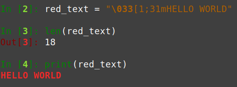

# Design considerations

## Lines off display area

Most terminals don't provide any mechanism to move outside the currently displayed area of text. This implies the fundamental limitation that coca cannot update a line that has scrolled outside of view. What happens in practice is that no matter the number of lines given to the ANSI escape codes to move the cursor up or down, the cursor will stop respectively at the first or last line of the display area. Coca currently doesn't handle this issue at all, and considers updating a line outside the view as "undefined behavior".

One use-case where this can be particularly problematic is when multiple threads are writing lines to stdout (for example a bunch of downloads), that they will update later at some point (for example with an `[OK]` label when one download is done). If one thread is occupied with a long task (a long download), the other threads can have enough time to print enough lines to make the terminal scroll, at which point the thread hanging on the long task won't be able to update its out-of-view line once it is finally done.

One way to address this would be to:

 - Introduce the notion of "frozen" lines (`Line.freeze()`). Once a line is frozen, it cannot be updated anymore.
 - Coca has access to the terminal height, and can therefore track whether a given line will scroll out of view.
 - Block any new printing that would push any unfrozen line out of view, until the line is frozen.

This should be optional and non-default, as it could be surprising to the uninitiated.


## Line-wrapping

In order to handle line-wrapping, coca needs to calculate the physical number of lines that a "line" will occupy, in order to appropriately shift following lines either up or down. To do that, it uses:

 1. Python's `shutil.get_terminal_size()` to get the terminal's width.
 2. Python's `str.__len__` on a string to get the length of the printed string.

The issue arises from the fact that the length of the string is not necessarily equal to the number of width "units" the string will physically occupy in the terminal.

Here are some known examples of such discrepancy:

### Newlines

As far as Python is concerned, a newline (`\n`) is juste 1 more character, but of course it physically adds a new line. This will be the easiest issue to fix: just sum line-wrapping sizes on chunks separated by newlines, and add the number of newlines to that.

Still, I'm not sure how tabs and the likes are represented on the terminal.


### "Large" Unicode characters

Some Unicode characters that Python considers to be of length 1 actually occupy more than 1 "unit of width" when printed to the terminal.

One example is some emojis:

```python
# 💖
# ^^ 2 units of width

len('💖')
# => 1 😢
```

Some non-latin characters can also be concerned:

```python
# 哲
# ^^ 2 units of width

len('哲')
# => 1
```

I'm not aware of any obvious solution to this. I should do further research into Unicode details to see how such things work.


### ANSI escape codes

Escape codes that allow altering the colors, boldness, etc, of the printed text are regular Unicode characters in the string as far as Python is concerned:



The way I would imagine solving this is by integrating text customization directly into coca, so that coca could be able to first render the string _without_ any escape code, get its length, and then render the same string with the escape codes for printing. In pseudo-code:

```python
line = session.line("Very important value: {value}", value=CocaValue(42, color='red'))

# would be implemented as

def line(template, **kwargs):
    raw_args = {name: coca_value.string_value for name, coca_value in kwargs}
    no_escape_codes_line = template.format(raw_args)
    printed_width = len(no_escape_codes_line)

    actual_line = coca_smart_formatter(template, **kwargs)
    print(actual_line)
```

That would of course only work as long as escape codes don't specifically alter the width of the printed strings. Which is true for stuff like colors and boldness, but might not necessarily be true for everything. But since this solution directly integrate formatting into coca, the contract could be "only use formatting available through coca".
